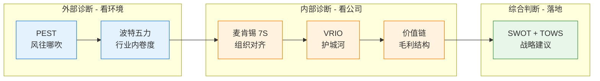
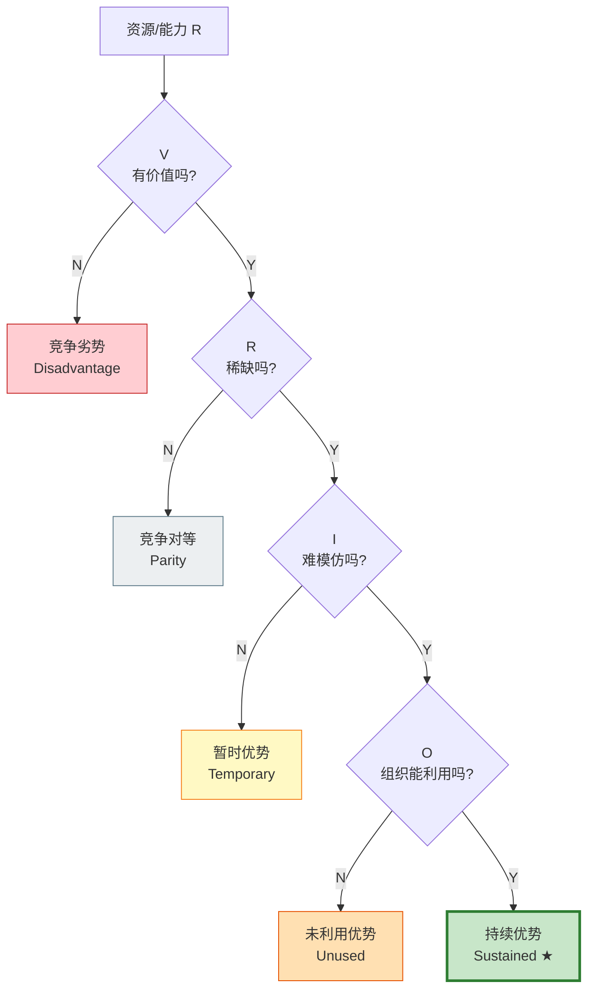
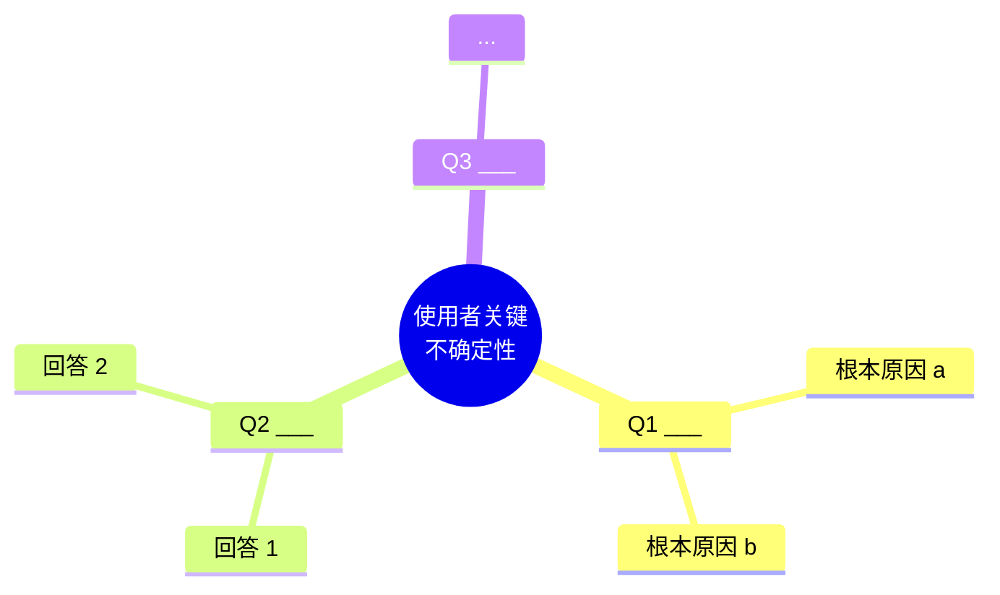

# [公司名] 六框架战略诊断报告

> **分析时间维度**：未来 2-3 年（或自定义）
> **分析师**：[填]
> **日期**：YYYY-MM-DD
> **数据截止**：YYYY-MM
> **用途**：[自用研究 / 客户交付 / 内部决策参考]
> **使用者公司**：[读自 ~/.company-diagnosis/user-profile.md 第一行]
> **本次诊断目的**：[读自 user-profile.md 的"本次诊断聚焦问题"字段；如缺失则标 "v0-skipped"]

---

## 相关历史调研（自动生成，如无则删除整段）

按 memory/_index.md 检索到的 4 维 tag 重合记录：

| 公司 | 日期 | 重合维度 | 关键洞察 | 处理 |
|---|---|---|---|---|
| ... | YYYY-MM-DD | 3/4 (行业+商业模式+目标客户) | ... | 直接引用 / 重新验证 |

---

# 序章:为什么用这六个框架?(铁律 9 强制)

> 任何报告都必须有这一节。**没有序章的报告,读者看不懂体系**——只看到 6 个分散的框架。
> **本报告涉及的所有缩写,统一在附录 G「术语 & 缩写表」中可查**(铁律 12)。首次出现处会用括号或灰底注释展开。

## 一句话回答

六框架做的是一件事:**把一家公司从外部环境到内部组织,完整诊断一遍,最后落到"该做什么"的战略建议**。它不是 6 个独立模型拼出来的清单,而是**一条因果链**——前一步的输出是后一步的输入。任何一步缺失或乱序,结论就不可信。

## 六框架的能力分工

| 顺序 | 框架 | 解决什么问题 | 一句话总结它的能力 |
|:-:|---|---|---|
| 1 | **PEST** | 外部宏观环境怎么样? | "**风往哪吹**" |
| 2 | **波特五力** | 行业竞争结构怎么样? | "**这个行业值不值得在里面内卷**" |
| 3 | **麦肯锡 7S** | 公司内部各要素是否对齐? | "**公司内部是不是在相互拉扯**" |
| 4 | **VRIO** | 哪些资源是真正的护城河? | "**什么能力是不可复制的**" |
| 5 | **价值链** | 钱从哪赚?花在哪?比对手强在哪? | "**毛利结构是什么样**" |
| 6 | **SWOT + TOWS** | 综合判断,该怎么做? | "**最终战略建议**" |

## 顺序为什么不能乱?



**外部 → 内部 → 综合**,共 3 段:

- **PEST → 五力**:外部环境从"大气候"(政经社技)到"行业小气候"(竞争结构)
- **7S → VRIO → 价值链**:内部诊断从"组织对齐"(7S)→"能力性质判定"(VRIO)→"钱的流向"(价值链)
- **SWOT + TOWS**:把前面 5 节的结论倒进一个 2×2 矩阵,落到行动

**乱序会发生什么?**
- 先做 SWOT 再做 PEST:SWOT 没有数据支撑,变拍脑袋
- 跳过 VRIO 直接做价值链:不知道哪些能力是真护城河,只看到成本结构
- 7S 不做对齐矩阵:看不到内部拉扯点,Weakness 全靠主观

这是这套方法论的**铁律**——咨询行业 30 年验证过的范式。

---

# 报告主体

## 一、PEST 宏观环境

### 框架解释(铁律 10 强制)

**PEST = Political 政治 + Economic 经济 + Social 社会 + Technological 技术**,扫描外部宏观环境对企业的影响。

**它反映什么**:回答"未来 2-3 年,大气候是顺风还是逆风?"——每条因素打方向(+/−)和强度(1-5),强度 ≥ 3 的会传到 SWOT 作为机会或威胁。

### PEST 强度可视化(铁律 11 强制,模板见 visualization-templates.md)

```
Political 维度
  <因素 1>     ████████████░░░░░░░░  +/−N 短/中/长

Economic 维度
  ...

Social 维度
  ...

Technological 维度
  ...
```

### 详细矩阵

| 维度 | 因素 | 方向 | 时间维度 | 强度 (1-5) | 证据 |
|---|---|:-:|:-:|:-:|---|
| Political | ... | + / − | 短/中/长 | N | [公开数据] |
| Economic | ... |  |  |  |  |
| Social | ... |  |  |  |  |
| Technological | ... |  |  |  |  |

**关键洞察(2-3 句)**:...

**→ 输入到 SWOT**:Opportunities ___ 条 / Threats ___ 条

---

## 二、波特五力

### 框架解释(铁律 10 强制)

**五力 = 现有竞争对手 + 供应商议价 + 买方议价 + 新进入者威胁 + 替代品威胁**,这是 Michael Porter 1979 年提出的行业结构分析框架。

**它反映什么**:回答"这个行业整体好不好混?**值不值得在里面卷?**"——每力打 1-5 分,5 = 对在位者最不利。**总分越低,行业越好**。

### 五力雷达可视化(铁律 11 强制)

```
                  行业内竞争 (N/5)
                        ●
                       ╱│╲
                      ╱ │ ╲
                     ╱  │  ╲
   供应商议价 (N/5) ●─────┼─────● 买方议价 (N/5)
                    ╲   │   ╱
                     ╲  │  ╱
                      ╲ │ ╱
                       ╲│╱
                        ●
            替代品 (N/5) ─ 新进入者 (N/5)

              ── 越往外越对在位者不利 ──
```

### 五力评估

| 力 | 强度 (1-5) | 关键理由 | 证据 |
|---|:-:|---|---|
| 行业内竞争 | N | ... | [公开数据] |
| 供应商议价 | N |  |  |
| 买方议价 | N |  |  |
| 新进入者 | N |  |  |
| 替代品 | N |  |  |

**行业总吸引力**:30 − (sum) = **N** 分(分越高越值得在内卷)

**关键洞察(2-3 句)**:...

**→ 输入到 SWOT**:Threats ___ 条 / Weaknesses ___ 条

---

## 三、麦肯锡 7S

### 框架解释(铁律 10 强制)

**7S = Strategy 战略 + Structure 结构 + Systems 系统(3 个 Hard S,看得见易调整) + Shared Values 共同价值观 + Style 领导风格 + Staff 员工 + Skills 组织能力(4 个 Soft S,文化软实力)**。

**它反映什么**:回答"公司内部 7 个要素**之间是否对齐**?"——单看一个 S 没用,要看 **7×7 矩阵**(任意两个 S 之间是相互支撑、中性、还是错配)。错配点就是 Weakness,高对齐三角就是 Strength。

**为什么要 7×7 矩阵**:战略再好,如果组织结构不配套(比如战略要做 ToB 但奖金还按 ToC 流量),就是相互拉扯,这种内部不一致是公司**真正的 Weakness 来源**——比表面看到的"哪个部门不行"更深层。

### 7 个要素

| 要素 | 类型 | 现状 | 证据 |
|---|:-:|---|---|
| Strategy 战略 | Hard | ... | [公开数据] |
| Structure 结构 | Hard |  |  |
| Systems 系统 | Hard |  |  |
| Shared Values 共同价值观 | Soft (核心) |  |  |
| Style 领导风格 | Soft |  |  |
| Staff 员工 | Soft |  |  |
| Skills 组织能力 | Soft |  |  |

### 7×7 对齐 Heatmap(铁律 11 强制)

> **怎么读**:🟢 高度对齐 / 🟡 对齐 / ⚪ 中性 / 🔴 错配
> 看模式:**对角线邻近 + 大块 🟢 = 战略-结构-能力三角自洽 = Strength**;**散落 🔴 = 内部拉扯 = Weakness**

|        | Strat | Struct | Sys | Values | Style | Staff | Skills |
|--------|:-----:|:------:|:---:|:------:|:-----:|:-----:|:------:|
| **Strat**  |  ━    |        |     |        |       |       |        |
| **Struct** |  ─    | ━     |     |        |       |       |        |
| **Sys**    |  ─    | ─     | ━   |        |       |       |        |
| **Values** |  ─    | ─     | ─   | ━     |       |       |        |
| **Style**  |  ─    | ─     | ─   |  ─    | ━     |       |        |
| **Staff**  |  ─    | ─     | ─   |  ─    | ─    | ━     |        |
| **Skills** |  ─    | ─     | ─   |  ─    | ─    | ─    | ━     |

### 错配清单
- 🔴 (Si, Sj) — 错配原因 + 影响
- ...

### 高对齐三角
- 🟢 Si ↔ Sj ↔ Sk = ___ 三角自洽

**→ 输入到 SWOT**:Weaknesses ___ 条(错配) / Strengths ___ 条(高对齐三角)

---

## 四、VRIO

### 框架解释(铁律 10 强制)

**VRIO = Value 有价值 + Rarity 稀缺 + Inimitability 难模仿 + Organization 组织能利用**,Jay Barney 1991 年提出,用来判定**一项资源/能力到底是不是真护城河**。

**怎么用**:严格走**决策树**(顺序不能乱、不能并行打分),按 V→R→I→O 走完才能定结论;结果只能落在 5 个标签之一:**持续优势 / 暂时优势 / 未利用优势 / 竞争对等 / 竞争劣势**。

**禁用"高/中/低"打分**——那是模糊评分,会让你把"还行的能力"误判成护城河。

### VRIO 决策树(铁律 11 强制)



### VRIO 评估表

| # | 资源/能力 | V | R | I | O | 结论 | 证据 |
|:-:|---|:-:|:-:|:-:|:-:|---|---|
| 1 | ... | Y | Y | Y | Y | 持续竞争优势 | [公开数据] |
| 2 | ... | Y | Y | N | — | 暂时优势 | [推断] |
| 3 | ... | Y | N | — | — | 竞争对等 | [行业共识] |
| 4 | ... | N | — | — | — | 竞争劣势 | [需验证] |
| 5 | ... | Y | Y | Y | N | 未利用优势 | [推断] |

**至少 5-10 个资源 / 能力**,覆盖:核心技术、品牌、客户网络、渠道、人才、文化、数据、生态。

**关键洞察(2-3 句)**:本公司真正的护城河是 ___。

**→ 输入到 SWOT**:Strengths ___ 条 / Weaknesses ___ 条

---

## 五、价值链(Porter)

### 框架解释(铁律 10 强制)

**价值链 = 5 项主要活动(进货物流 / 运营 / 出货物流 / 营销与销售 / 服务)+ 4 项支持活动(基础设施 / HRM / 技术开发 / 采购)**,Michael Porter 1985 年提出。

**它反映什么**:回答 3 个问题——**钱花在哪?(成本结构)毛利从哪来?(差异化来源)哪些环节比对手强?(相对优势)**

**关键产出**:每个活动标 cost driver / differentiator;然后跟主要竞品逐项 PK(领先 / 持平 / 落后)。**这一步直接告诉你 Strength / Weakness 在哪个具体环节**。

### Porter 经典价值链(铁律 11 强制,标注版)

```
┌──────────────────────────────────────────────────────────────────┐
│  支持活动  (Support Activities)                                    │
├──────────────────────────────────────────────────────────────────┤
│  公司基础设施 [type]    <说明>                                       │
│  HRM         [type]    <说明>                                       │
│  技术开发     [type]    <说明>                                       │
│  采购         [type]    <说明>                                       │
├──────────────────────────────────────────────────────────────────┤
│  主要活动  (Primary Activities)                                    │
├────────────┬──────────┬─────────┬────────────┬──────────────────┤
│  进货物流   │  运营     │ 出货物流 │ 营销与销售  │  服务            │
│  [type]    │ [type]   │ [type]  │ [type]     │  [type]          │
│  <说明>     │ <说明>    │ <说明>   │ <说明>      │ <说明>            │
└────────────┴──────────┴─────────┴────────────┴──────────────────┘
                                                          ↓
                                                    [毛利创造]
```

### 主要活动

| 活动 | 占成本 % | 类型 | vs 竞品 | 证据 |
|---|:-:|:-:|:-:|---|
| 进货物流 / 研发原料 |  | cost / diff | 领先 / 持平 / 落后 |  |
| 运营 / 产品研发 |  |  |  |  |
| 出货物流 / 交付部署 |  |  |  |  |
| 营销与销售 |  |  |  |  |
| 服务 / 客户成功 |  |  |  |  |

### 支持活动

| 活动 | 占成本 % | 类型 | vs 竞品 | 证据 |
|---|:-:|:-:|:-:|---|
| 公司基础设施 |  |  |  |  |
| HRM |  |  |  |  |
| 技术开发 |  |  |  |  |
| 采购 |  |  |  |  |

**毛利创造点**:___ 活动是主要差异化来源。
**成本拖累点**:___ 活动是主要 cost driver 落后。

**→ 输入到 SWOT**:Strengths ___ 条 / Weaknesses ___ 条

---

## 六、SWOT + TOWS 综合

### 框架解释(铁律 10 强制)

**SWOT = 4 个桶(Strengths 优势 / Weaknesses 劣势 / Opportunities 机会 / Threats 威胁)**;S/W 是内部(来自 7S/VRIO/价值链),O/T 是外部(来自 PEST/五力)。

**SWOT 只是清单**——真正给战略的是 **TOWS 矩阵**:把 S×O、W×O、S×T、W×T 4 组配对,产出 4 类策略(攻击 / 扭转 / 防御 / 避险)。

**铁律**:SWOT 每条必须带 `[来源:框架-子项]` 引用——否则就是拍脑袋,不是诊断。

### SWOT 清单(每条带来源引用 + 编号)

**Strengths**
- **S1.** [来源: ___] ... [证据]
- **S2.** [来源: ___] ... [证据]

**Weaknesses**
- **W1.** [来源: ___] ... [证据]

**Opportunities**
- **O1.** [来源: ___] ... [证据]

**Threats**
- **T1.** [来源: ___] ... [证据]

### TOWS 矩阵(铁律 11 强制,强化样式)

|              | 优势 (S) | 劣势 (W) |
|--------------|----------|----------|
| **机会 (O)<br/>(SO 攻击 / WO 扭转)** | **SO** (用 S 抓 O):___ — 用到 S_, O_ | **WO** (补 W 抓 O):___ — 用到 W_, O_ |
| **威胁 (T)<br/>(ST 防御 / WT 避险)** | **ST** (用 S 防 T):___ — 用到 S_, T_ | **WT** (避险):___ — 用到 W_, T_ |

每象限至少 1 条策略,**必须显式引用 SWOT 编号**。

### 战略建议(一句话收束)

> 🎯 [公司应在 **___** 上聚焦 + 在 **___** 上加速 + 在 **___** 上防范。]

---

## 七、对使用者商业路径的启示

### 框架解释(铁律 10 强制)

前 6 节是给目标公司看的报告;**第七节是给使用者(西鸣 / 你 / 任何用 skill 的人)看的执行建议**——把对标公司的护城河拆解成"哪些可借鉴 / 哪些避免 / 哪些挑战你的红线 / profile 该怎么改"4 个层次。

**与其他研报最大区别**:不是"读完就完了",而是**每条启示都落到 profile 的具体字段、具体红线**——让诊断真正改变你公司的下一步动作。

> 这一节是把诊断结论**反哺回 user-profile.md**,是 v2 设计的最终落地动作。
> 如果使用者跳过了 onboarding(v0-skipped profile),在此节顶部加红字 ⚠️ 提示,按通用模式输出。

### 7.0 直接回答 onboarding 时填的"本次诊断目的"

(从 user-profile.md 的"本次诊断聚焦问题"字段读取,**逐问回答**)

- 问题 1:___
  - 答:___
- 问题 2:___
  - 答:___

### 7.1 直接借鉴

本次 [目标公司] 哪些能力 / 策略可以被使用者借鉴?

| # | 借鉴点 | 来源 | 使用者可执行的具体动作 |
|:-:|---|---|---|
| 借1 | ___ | [来源: ___] | ___ |

### 7.2 主动避免

本次 [目标公司] 哪些失误 / 路径选择应该被使用者规避?

| # | 避免点 | 来源 | 使用者应规避的动作 |
|:-:|---|---|---|
| 避1 | ___ | [来源: ___] | ___ |

### 7.3 验证 / 挑战的 profile 假设

| profile 字段 | 现状 | 本次发现 | 状态 |
|---|---|---|---|
| 核心商业纪律 #N 「<原文>」 | 不可妥协 / 可调整 | 本次发现 ... | ✅ 验证 / ⚠️ 挑战 / ❓ 待观察 |
| 路线图 QN 「<原文>」 | 已立 | 本次发现 ... | ✅ 验证 / ⚠️ 挑战 / ❓ 待观察 |
| 关键不确定性 #N 「<原文>」 | 未解 | 本次发现 ... | ✅ 部分回答 / ❓ 仍未解决 |
| 重点对标 #N | 「<公司>」 | 本次发现 ... | ✅ 仍合适 / ⚠️ 该换 / ➕ 加一家 |

### 7.4 user-profile.md 更新建议

| 字段 | 建议动作 | 理由 |
|---|---|---|
| <字段名> | 修改 / 新增 / 删除 | <一句话理由> |

**是否触发版本升级**:建议 v_._ → v_._

> **执行约定**:诊断结束后会主动询问使用者「要按以上建议更新 user-profile.md 吗?」。使用者拍板后旧版本归档到 `user-profile.history/`,新版本号 +1。

### 7.5 战略路线图(铁律 11 强制)

#### 关键不确定性的回答地图(mindmap)



#### 立即可做的动作甘特图

```mermaid
gantt
    title 使用者战略改造路线图(基于本次诊断)
    dateFormat YYYY-MM-DD
    section 本周内
    动作 1: active, w1, YYYY-MM-DD, 7d
    section 本月内
    动作 2: m1, after w1, 30d
    section 本季内
    动作 3: q1, after m1, 60d
```

---

## 附录

### A. 强度 ≤ 2 的 PEST 因素 / 五力子项(未进 SWOT 主体)

### B. 数据待验证项([需验证] 标签汇总)

### C. 关键数据源 / 公开资料引用

### D. 信源自检

| 标签 | 数量 | 要求 |
|---|:-:|---|
| `[公开数据]` | N | ≥ 5 |
| `[行业共识]` | N | — |
| `[需验证]` | N | 已汇总到 B 段 |
| `[推断]` | N | — |
| 黑名单触碰 | 0 / 触碰哪一条 | 必须改 |

### E. 归档信息(双份)

- Markdown:`~/.company-diagnosis/memory/<公司>-<日期>.md`
- **PDF**:`~/.company-diagnosis/memory/<公司>-<日期>.pdf`(用 tools/md2html.ps1 或 tools/md2pdf.sh 转;铁律 11)
- _index.md 更新:✅ 已 append 一行(含 4 维 tag)
- user-profile 更新建议:见第七节 7.4

### F. 4 维 tag(用于跨公司检索)

- **行业**:___
- **规模**:___
- **商业模式**:___
- **目标客户**:___

### G. 术语 & 缩写表(铁律 12 强制,按字母顺序)

> **必填**。每份报告都要有这一节。
> **怎么填**:扫描全文,把每个出现过的英文缩写 / 行业术语收集进来,**按字母顺序**排序。
> **目的**:让没有战略 / 行业背景的读者(团队 / 合伙人 / 投资人)能查到每个缩写是什么意思。

| 缩写 | 全称(英文) | 中文意思 |
|---|---|---|
| **PEST** | Political / Economic / Social / Technological | 宏观环境分析框架(政治 / 经济 / 社会 / 技术) |
| **VRIO** | Value / Rarity / Inimitability / Organization | 资源/能力的护城河判定决策树 |
| **SWOT** | Strengths / Weaknesses / Opportunities / Threats | 优势 / 劣势 / 机会 / 威胁 综合分析 |
| **TOWS** | SWOT 反向矩阵 | SWOT 的 2×2 配对落地,4 类策略(攻击 / 扭转 / 防御 / 避险) |
| **7S** | Strategy / Structure / Systems / Shared Values / Style / Staff / Skills | 麦肯锡 7 要素组织诊断 |
| **五力** | Porter's Five Forces | 行业竞争结构 5 维度(竞争 / 供应商 / 买方 / 新进入者 / 替代品) |
| **价值链** | Porter Value Chain | 5 项主要活动 + 4 项支持活动构成的成本 / 差异化结构 |
| **DTC** | Direct-to-Consumer | 直营消费者(品牌自营,跳过经销商) |
| **CR5 / CR3** | Concentration Ratio 5/3 | 前 5/3 名市场份额合计,衡量行业集中度 |
| **HHI** | Herfindahl-Hirschman Index | 市场集中度指数,平方加和 |
| **GMV** | Gross Merchandise Value | 商品交易总额 |
| **MRR / ARR** | Monthly / Annual Recurring Revenue | 月 / 年经常性收入 |
| **PMF** | Product-Market Fit | 产品-市场契合度 |
| **SKU** | Stock Keeping Unit | 库存单位(每个商品规格独立编号) |
| **ToB / ToC** | to Business / to Consumer | 面向企业 / 面向消费者 |
| **HRM** | Human Resource Management | 人力资源管理 |
| **P&L** | Profit and Loss | 损益表 / 独立核算单元 |
| **BD** | Business Development | 业务拓展 / 商务团队 |
| **CAPEX / OPEX** | Capital / Operating Expenditure | 资本性支出 / 运营支出 |
| **KPI / OKR** | Key Performance Indicator / Objectives & Key Results | 关键绩效指标 / 目标与关键结果 |
| **ISV** | Independent Software Vendor | 独立软件开发商 |
| **IR** | Investor Relations | 投资者关系 |
| **AI** | Artificial Intelligence | 人工智能 |

> **报告写作约定**(铁律 12):**首次出现缩写时,在该处用括号或灰底注释展开**(如 `DTC(Direct-to-Consumer,直营消费者)`)。后续出现可用缩写。
> 上表是**模板**,实际报告应根据全文出现的缩写定制——删除未用到的,增补行业特有的(如医疗行业的 FDA、金融的 IRR、电商的 ROAS)。
