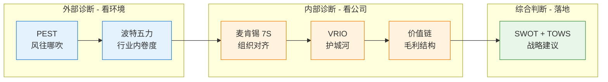
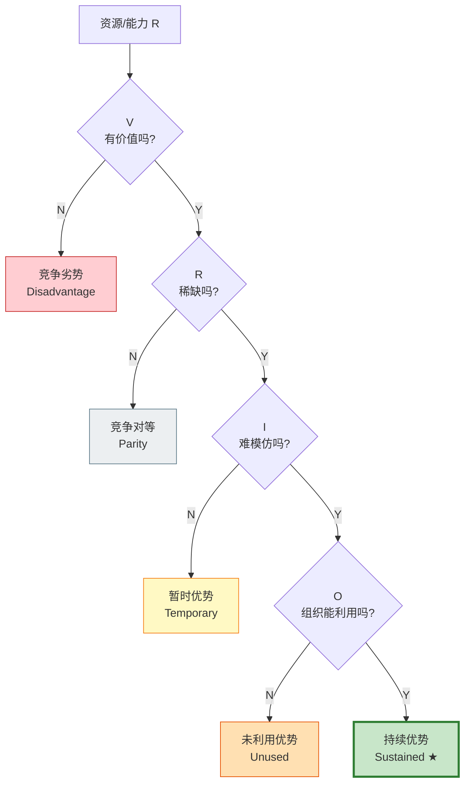
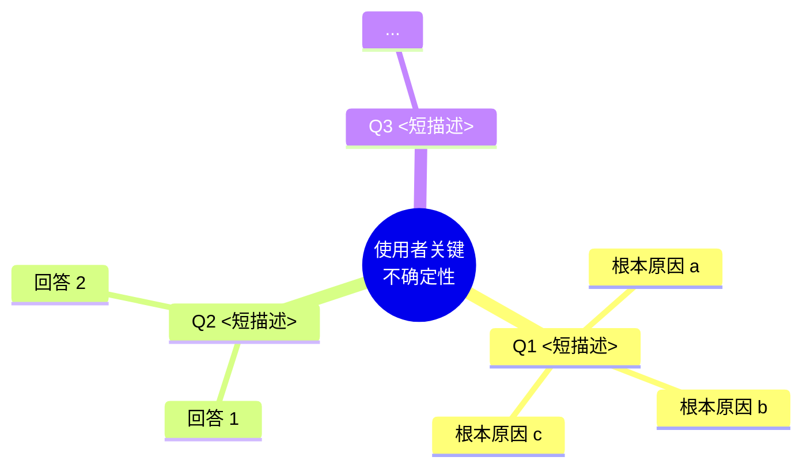

# 可视化模板库(铁律 11 强制使用)

> 这个文件是给 LLM 执行 skill 时的**可视化模板手册**。每个框架都有标准 Mermaid 或 ASCII 模板,直接套用,确保所有报告视觉风格一致。

## 序章:六框架方法论流程图

每份报告序章必备:



---

## 一、PEST 强度可视化

每条因素一行,用 `█` 显示强度,`+` / `−` 显示方向:

```
Political 维度
  <因素>     ████████████░░░░░░░░  +/−N 短/中/长

Economic 维度
  <因素>     ████████░░░░░░░░░░░░  +/−N 短/中/长

Social 维度
  <因素>     ████████████████░░░░  +/−N 短/中/长 ★(强度 ≥ 5 加 ★)

Technological 维度
  <因素>     ████████████░░░░░░░░  +/−N 短/中/长
```

**强度对应填充长度**:
- 1/5 → ████░░░░░░░░░░░░░░░░
- 2/5 → ████████░░░░░░░░░░░░
- 3/5 → ████████████░░░░░░░░
- 4/5 → ████████████████░░░░
- 5/5 → ████████████████████ ★

---

## 二、波特五力雷达

ASCII 雷达,5 个顶点显示 5 力评分:

```
                  行业内竞争 (N/5)
                        ●
                       ╱│╲
                      ╱ │ ╲
                     ╱  │  ╲
   供应商议价 (N/5) ●─────┼─────● 买方议价 (N/5)
                    ╲   │   ╱
                     ╲  │  ╱
                      ╲ │ ╱
                       ╲│╱
                        ●
            替代品 (N/5) ─ 新进入者 (N/5)

              ── 越往外越对在位者不利 ──
```

---

## 三、麦肯锡 7×7 对齐 Heatmap

用 emoji 代替纯 ✓/✗,让 heatmap 有颜色:

|        | Strat | Struct | Sys | Values | Style | Staff | Skills |
|--------|:-----:|:------:|:---:|:------:|:-----:|:-----:|:------:|
| **Strat**  |  ━    | 🟢   | 🟢 |  🟡   | 🟢   | 🟡   | 🟢   |
| **Struct** |  ─    | ━     | 🟢 |  🟡   | ⚪   | 🟢   | 🟢   |
| **Sys**    |  ─    | ─     | ━   |  ⚪   | ⚪   | 🟡   | 🟡   |
| **Values** |  ─    | ─     | ─   | ━     | 🟢   | 🟡   | 🟡   |
| **Style**  |  ─    | ─     | ─   |  ─    | ━     | 🔴   | 🟡   |
| **Staff**  |  ─    | ─     | ─   |  ─    | ─    | ━     | 🟡   |
| **Skills** |  ─    | ─     | ─   |  ─    | ─    | ─    | ━     |

**Emoji 含义**:
- 🟢 高度对齐
- 🟡 对齐
- ⚪ 中性
- 🔴 错配

**怎么读**:对角线邻近 + 大块 🟢 = 战略-结构-能力三角自洽;散落 🔴 = 内部拉扯。

---

## 四、VRIO 决策树



---

## 五、价值链 Porter 经典图

ASCII 版(2 层结构 + 标注):

```
┌──────────────────────────────────────────────────────────────────┐
│  支持活动  (Support Activities)                                    │
├──────────────────────────────────────────────────────────────────┤
│  公司基础设施 [diff/cost]    <说明>                                  │
│  HRM         [diff/cost]    <说明>                                  │
│  技术开发     [diff/cost]    <说明>                                  │
│  采购         [diff/cost]    <说明>                                  │
├──────────────────────────────────────────────────────────────────┤
│  主要活动  (Primary Activities)                                    │
├────────────┬──────────┬─────────┬────────────┬──────────────────┤
│  进货物流   │  运营     │ 出货物流 │ 营销与销售  │  服务            │
│  [type]    │ [type]   │ [type]  │ [type]     │  [type]          │
│  <说明>     │ <说明>    │ <说明>   │ <说明>      │ <说明>            │
└────────────┴──────────┴─────────┴────────────┴──────────────────┘
                                                          ↓
                                                    [毛利创造]
```

`[type]` 标注 `cost driver` / `differentiator` / `both`,后面加 vs 竞品的"领先 / 持平 / 落后"。

---

## 六、SWOT + TOWS 强化样式 2×2 矩阵

|              | 优势 (S) | 劣势 (W) |
|--------------|----------|----------|
| **机会 (O)<br/>(SO 攻击 / WO 扭转)** | **SO-1**:[S_ + S_ → O_] 具体策略<br/>**SO-2**:... | **WO-1**:[补 W_ → O_] ...<br/>**WO-2**:... |
| **威胁 (T)<br/>(ST 防御 / WT 避险)** | **ST-1**:[S_ + S_ → 防 T_] ...<br/>**ST-2**:... | **WT-1**:[压 W_ → 防 T_] ...<br/>**WT-2**:... |

**关键**:每条策略必须显式引用 S_/W_/O_/T_ 编号——这是 TOWS 区别于其它 4 象限图的核心。

---

## 七、第七节战略路线图

### 关键不确定性的回答地图(mindmap)



### 立即可做的动作甘特图

```mermaid
gantt
    title 使用者战略改造路线图(基于本次诊断)
    dateFormat YYYY-MM-DD
    section 本周内
    动作 1: active, w1, YYYY-MM-DD, 7d
    动作 2: w2, after w1, 5d
    section 本月内
    动作 3: m1, YYYY-MM-DD, 30d
    section 本季内
    动作 4: q1, YYYY-MM-DD, 60d
    动作 5: q2, after q1, 30d
```

---

## 颜色 / 视觉规范

| 用途 | 颜色(填充 / 边框) | 在哪用 |
|---|---|---|
| **外部诊断**(PEST、五力) | `#E3F2FD` / `#1976D2`(浅蓝) | 序章流程图 |
| **内部诊断**(7S、VRIO、价值链) | `#FFF3E0` / `#F57C00`(浅橙) | 序章流程图 |
| **综合判断**(SWOT) | `#E8F5E9` / `#388E3C`(浅绿) | 序章流程图 |
| **VRIO 持续优势** | `#C8E6C9` / `#2E7D32`(深绿) | VRIO 决策树终结点 |
| **VRIO 未利用优势** | `#FFE0B2` / `#E65100`(橙) | VRIO 决策树终结点 |
| **VRIO 暂时优势** | `#FFF9C4` / `#F57F17`(浅黄) | VRIO 决策树终结点 |
| **VRIO 竞争对等** | `#ECEFF1` / `#607D8B`(灰) | VRIO 决策树终结点 |
| **VRIO 竞争劣势** | `#FFCDD2` / `#C62828`(红) | VRIO 决策树终结点 |
| **7S Heatmap** | 🟢🟡⚪🔴 | 7×7 矩阵 |

## 检查清单(铁律 11 自检)

- [ ] 序章有六框架方法论 Mermaid 流程图
- [ ] PEST 有强度可视化(条形或表格)
- [ ] 五力有雷达图或评分图
- [ ] 7S 有 7×7 Heatmap(emoji 颜色,不只是 ✓/✗)
- [ ] VRIO 有 Mermaid 决策树
- [ ] 价值链有 Porter 经典图(ASCII 或 mermaid)
- [ ] SWOT + TOWS 是 2×2 矩阵带象限标注
- [ ] 第七节有 mindmap + gantt
